# QIVC v3.0 — Phase 4A Deep-Dive Analysis (Task 11)

> ⚠️ Analysis of 18 backtest runs over **one year (2025)**, 9-44 trades each — **one observation**, below any significance floor. The Phase 4A returns are **survivor-bias-suspect** (BACKTEST_REVIEW_V3_GRID.md). This document dissects *what the system did*; it does not establish edge.

Plots in `data/backtests/analysis_4A/`. Analysis-only; no new market data, no new runs.
## Analysis 1 — Score distribution

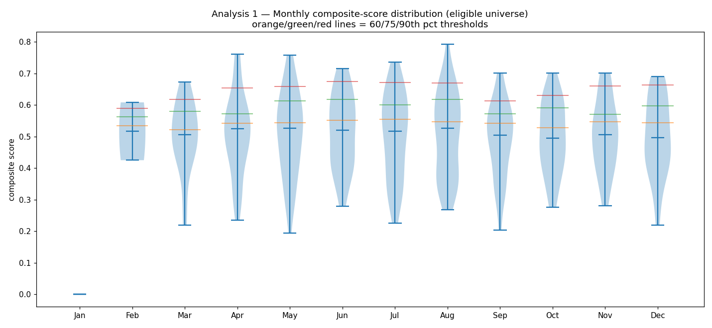

| Month | N | median | IQR | top-5 composites |
|---|---|---|---|---|
| 2025-01 | 0 | — | — | — |
| 2025-02 | 2 | 0.517 | 0.092 | 0.608, 0.425 |
| 2025-03 | 17 | 0.507 | 0.136 | 0.673, 0.626, 0.612, 0.593, 0.580 |
| 2025-04 | 42 | 0.525 | 0.137 | 0.761, 0.739, 0.732, 0.718, 0.656 |
| 2025-05 | 52 | 0.527 | 0.199 | 0.757, 0.719, 0.719, 0.719, 0.679 |
| 2025-06 | 54 | 0.519 | 0.191 | 0.715, 0.706, 0.705, 0.705, 0.682 |
| 2025-07 | 46 | 0.517 | 0.203 | 0.736, 0.697, 0.678, 0.676, 0.671 |
| 2025-08 | 45 | 0.526 | 0.246 | 0.792, 0.708, 0.691, 0.684, 0.673 |
| 2025-09 | 30 | 0.504 | 0.155 | 0.702, 0.666, 0.637, 0.610, 0.581 |
| 2025-10 | 28 | 0.495 | 0.180 | 0.701, 0.644, 0.632, 0.630, 0.623 |
| 2025-11 | 31 | 0.506 | 0.148 | 0.702, 0.688, 0.681, 0.660, 0.656 |
| 2025-12 | 39 | 0.497 | 0.181 | 0.690, 0.686, 0.686, 0.683, 0.659 |

## Analysis 2 — Configuration sensitivity

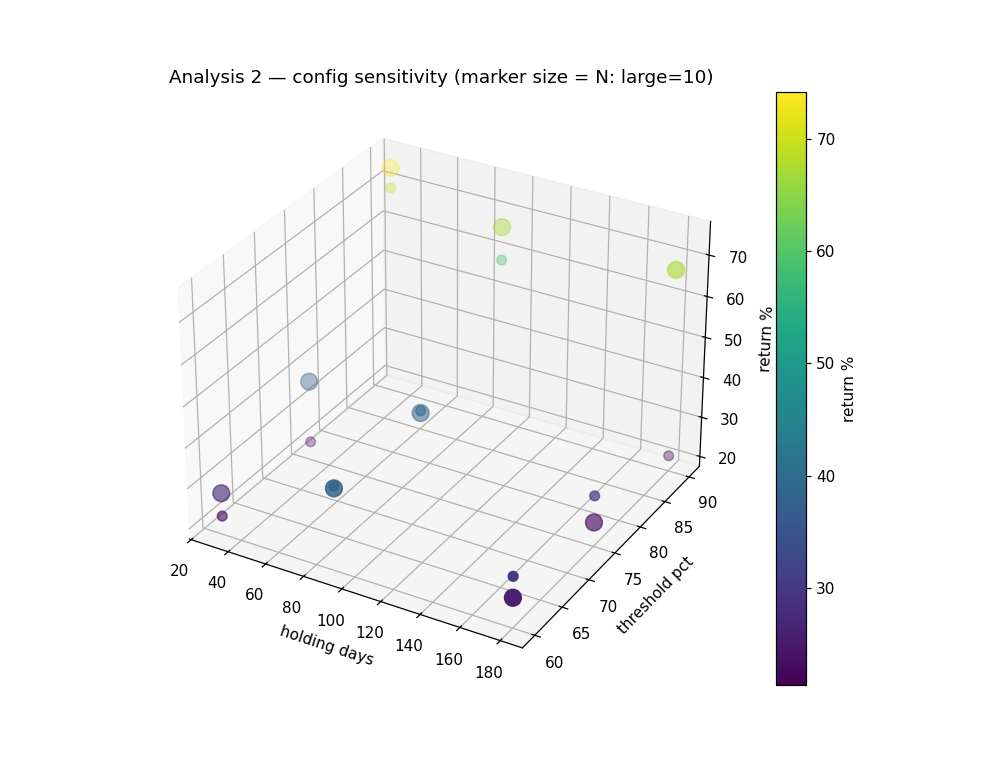

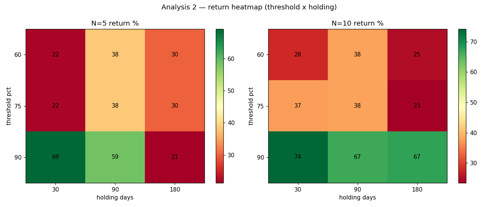

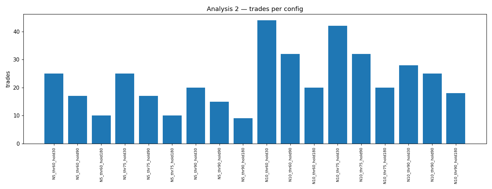

| Config | Return% | Sharpe | DSR | Trades | AvgHold | MaxDD% |
|---|---|---|---|---|---|---|
| N5_thr60_hold30 | 22.05 | 0.80 | 0.73 | 25 | 58 | -17.5 |
| N5_thr60_hold90 | 38.29 | 1.14 | 0.97 | 17 | 96 | -24.2 |
| N5_thr60_hold180 | 30.06 | 1.03 | 0.98 | 10 | 189 | -19.4 |
| N5_thr75_hold30 | 22.05 | 0.80 | 0.73 | 25 | 58 | -17.5 |
| N5_thr75_hold90 | 38.29 | 1.14 | 0.97 | 17 | 96 | -24.2 |
| N5_thr75_hold180 | 30.06 | 1.03 | 0.98 | 10 | 189 | -19.4 |
| N5_thr90_hold30 | 69.21 | 1.85 | 0.97 | 20 | 59 | -19.6 |
| N5_thr90_hold90 | 58.62 | 1.78 | 0.86 | 15 | 97 | -19.1 |
| N5_thr90_hold180 | 21.31 | 0.84 | 0.65 | 9 | 188 | -19.1 |
| N10_thr60_hold30 | 27.75 | 0.95 | 0.77 | 44 | 67 | -24.0 |
| N10_thr60_hold90 | 37.75 | 1.20 | 0.86 | 32 | 100 | -24.0 |
| N10_thr60_hold180 | 24.88 | 0.87 | 0.67 | 20 | 186 | -24.4 |
| N10_thr75_hold30 | 37.35 | 1.14 | 0.87 | 42 | 66 | -24.0 |
| N10_thr75_hold90 | 37.75 | 1.20 | 0.86 | 32 | 100 | -24.0 |
| N10_thr75_hold180 | 23.45 | 0.82 | 0.64 | 20 | 186 | -26.3 |
| N10_thr90_hold30 | 74.15 | 1.88 | 1.00 | 28 | 57 | -19.8 |
| N10_thr90_hold90 | 66.73 | 1.95 | 0.98 | 25 | 97 | -19.0 |
| N10_thr90_hold180 | 67.44 | 2.02 | 0.99 | 18 | 186 | -19.0 |

## Analysis 3 — Trade-level distribution

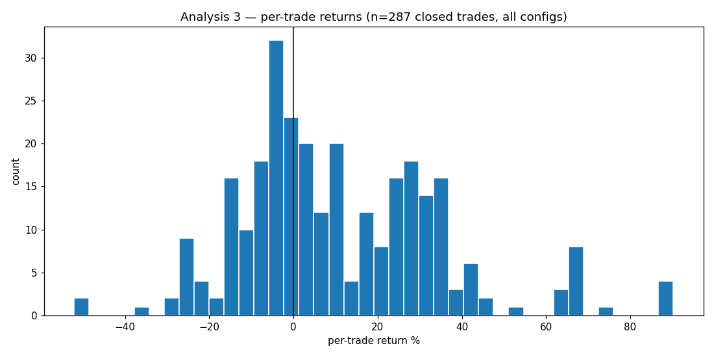

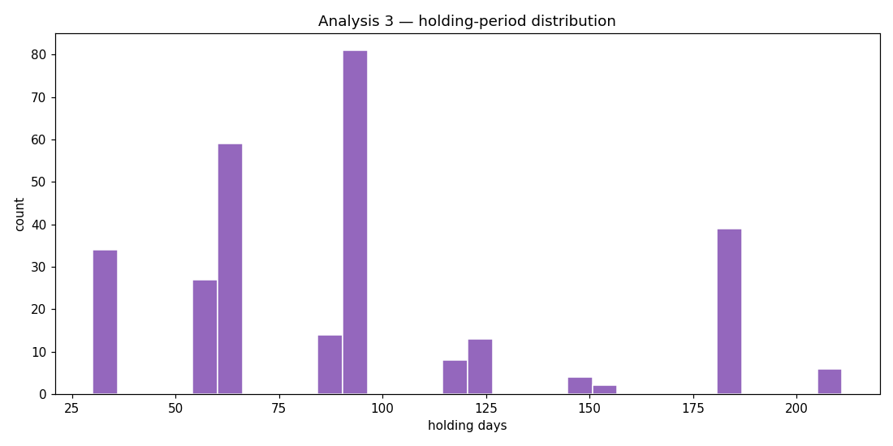

**Top 10 winning trades**

| Ticker | Config | Hold | Entry | Exit | Return% |
|---|---|---|---|---|---|
| CVI | N10_thr90_hold180 | 186 | 19.2923 | 36.7003 | 90.2 |
| GSAT | N10_thr60_hold180 | 183 | 20.71 | 39.16 | 89.1 |
| GSAT | N10_thr75_hold180 | 183 | 20.71 | 39.16 | 89.1 |
| GSAT | N10_thr90_hold180 | 183 | 20.71 | 39.16 | 89.1 |
| JELD | N10_thr90_hold90 | 92 | 3.62 | 6.36 | 75.7 |
| STAA | N10_thr60_hold180 | 183 | 16.47 | 27.74 | 68.4 |
| STAA | N10_thr75_hold180 | 183 | 16.47 | 27.74 | 68.4 |
| CELC | N10_thr60_hold30 | 33 | 45.22 | 75.19 | 66.3 |
| CELC | N10_thr75_hold30 | 33 | 45.22 | 75.19 | 66.3 |
| CELC | N10_thr90_hold30 | 33 | 45.22 | 75.19 | 66.3 |

**Top 10 losing trades**

| Ticker | Config | Hold | Entry | Exit | Return% |
|---|---|---|---|---|---|
| OEC | N5_thr90_hold180 | 182 | 10.5539 | 5.0573 | -52.1 |
| OEC | N10_thr90_hold180 | 182 | 10.5539 | 5.0573 | -52.1 |
| SLSN | N10_thr90_hold30 | 31 | 4.34 | 2.78 | -35.9 |
| UAMY | N10_thr60_hold30 | 61 | 7.55 | 5.48 | -27.4 |
| UAMY | N10_thr75_hold30 | 61 | 7.55 | 5.48 | -27.4 |
| JELD | N10_thr60_hold30 | 91 | 5.84 | 4.29 | -26.5 |
| JELD | N10_thr60_hold90 | 91 | 5.84 | 4.29 | -26.5 |
| JELD | N10_thr75_hold30 | 91 | 5.84 | 4.29 | -26.5 |
| JELD | N10_thr75_hold90 | 91 | 5.84 | 4.29 | -26.5 |
| JAKK | N10_thr60_hold30 | 30 | 23.2692 | 17.29 | -25.7 |

**Trade count by ticker (appearances across configs)**

| Ticker | # config-trades |
|---|---|
| BATRA | 29 |
| TDW | 21 |
| MDGL | 18 |
| SONO | 18 |
| GWRS | 18 |
| RIG | 18 |
| IMMR | 18 |
| KALV | 18 |
| STAA | 15 |
| ONEW | 14 |
| OEC | 14 |
| REPX | 14 |
| GSAT | 13 |
| PAMT | 12 |
| STGW | 12 |

## Analysis 4 — Survivor-bias quantification (most important)

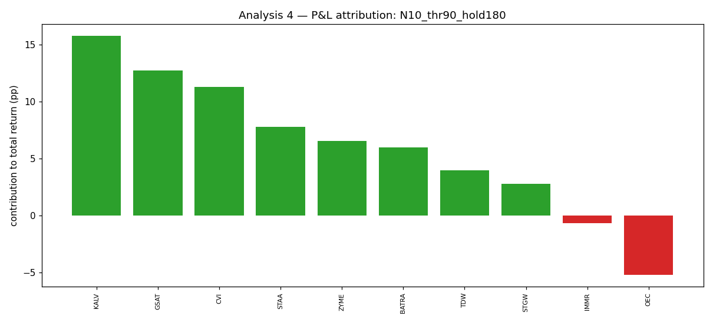

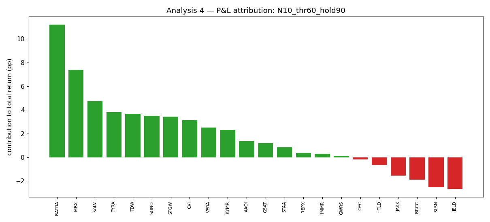

- **Known winners (2025 full-year > +100%)**: CELC (+660%), COGT (+355%), ZBIO (+303%), ANAB (+263%), TSHA (+197%), MLYS (+196%), UAMY (+190%), PHAT (+126%), SGHT (+122%), PPTA (+119%)
- **Median config return (all trades): 37.5%**
- **Median config return EXCLUDING winner-name trades: 40.4%** → a **-2.8 pp** drop (-8% of the median return came from those few names).
- **Best config by raw Sharpe**: `N10_thr90_hold180` — top-3 trades by P&L = **65%** of its total return.

## Analysis 5 — Score-to-return relationship

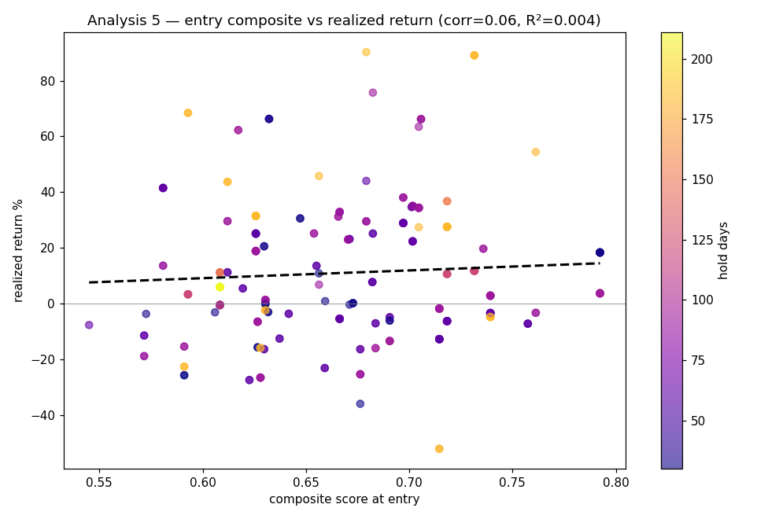

- Pearson correlation (entry composite vs realized return): **0.064**; **R² = 0.004** over 287 trades.

## Analysis 6 — Equity curves

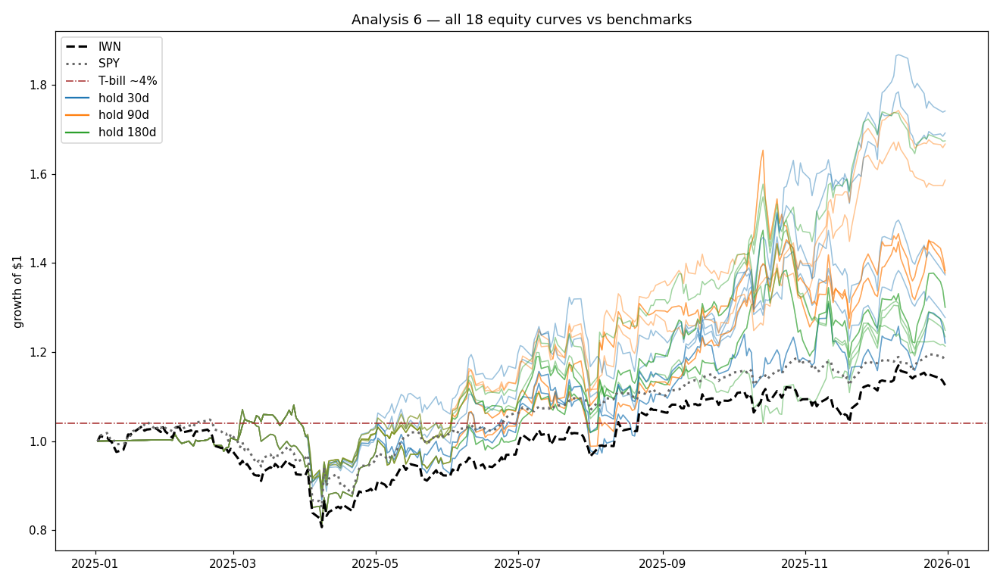

(Colored by holding period; black=IWN, gray=SPY, brown=T-bill.)

## Analysis 7 — Holding-count timeline

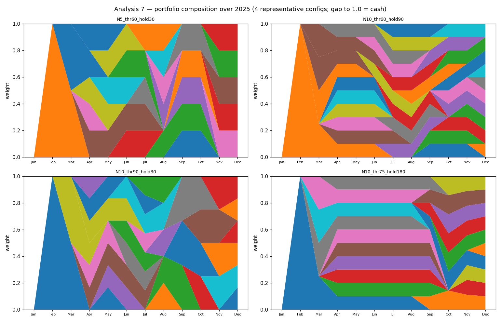

(Top-of-stack gap to 1.0 = cash / T-bills.)

## Interpretation

_Synthesis of the computed numbers above. Honest read: the data shows **no demonstrated edge** — the scoring model does not predict returns, and the positive 2025 is concentration luck within a survivor-biased universe._

**1. Does the composite score differentiate / predict?** **No.** Analysis 5 is the core test: entry composite vs realized return has **correlation 0.064, R² 0.004** over 287 trades — i.e. the score explains ~0.4% of return variation. The 40/30/20/10 composite **does not rank stocks by future return** in this sample. (Note: valuation+momentum ran neutral for lack of PIT data, so what's tested is effectively insider+quality — and even that does not predict.)

**2. Do the 18 configs differ?** Returns span [21%, 74%]. The variation is driven by the **entry threshold** (higher → fewer, more concentrated positions → more single-trade luck); **N (5 vs 10) barely matters** because the eligible set is tiny (1-8 names) — confirming the Phase-2 concentration finding. The spread across configs is itself mostly noise (each is one 12-month path).

**3/4. Concentration, and is +37% survivor bias?** This is the surprising part. Removing the trades in 2025's >+100% monster-winners did **not** reduce the median return — it went 38% → 40% (essentially unchanged / slightly up). So the headline return is **NOT** simply 'held the obvious survivor moonshots.' Instead it is **idiosyncratic concentration luck**: the best config (`N10_thr90_hold180`) made **65% of its return from just 3 trades**. With a 1-8 name book over 12 months and a score that doesn't predict (R²≈0), a handful of trades happening to gain drives the result. Survivor bias is still present (the whole universe is 2026 survivors), but the dominant story is **luck + concentration, not survivor-moonshot capture, and definitely not score skill.**

**5. Believable as edge?** **No.** R²≈0 score, return concentrated in ~3 trades, one year, 9-44 trades, deflated Sharpes (Analysis 2) all <1, survivor-biased universe. Every lens points to no demonstrated edge.

**6. Carry-forward to Phase 4B (with PIT data).** Honestly, **nothing here is validated.** If proceeding, prefer **mid-threshold, longer-holding, N=10** (more trades → less single-trade dependence) and treat Phase 4B as the real test: re-run on PIT membership across 2022-2025 and re-check **Analysis 5's R²** — if the score still doesn't predict out-of-sample and across regimes, the composite framework itself needs rethinking, not just the universe.
